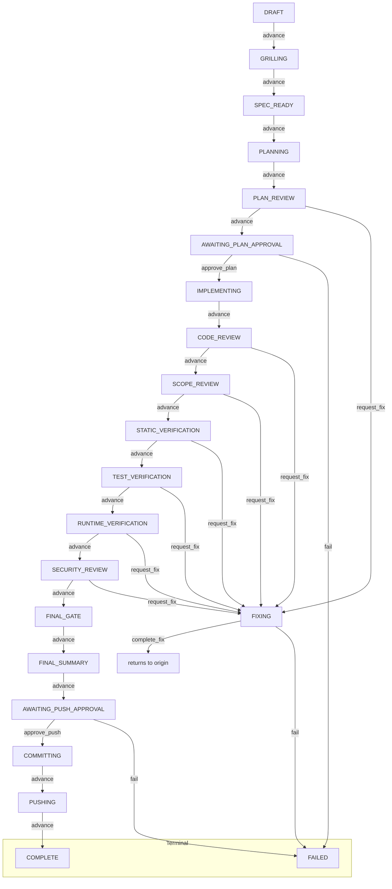

# Agent Workflow Kit

An agent-independent, deterministic software development workflow toolkit that separates workflow logic from any specific coding agent. It provides a gated workflow with human approvals, deterministic verification against a project's own commands, and isolated execution in Git worktrees. Decisions are based on measured evidence (exit codes, file changes, digests) rather than model opinions.

## Status

**What works today (verified):**
- Core workflow engine (`core/`) with 21 states, legal transitions, and fix return tracking.
- Workflow orchestrator (`orchestration/`) with approval checkpoints, bounded fix loop (max 5 attempts), revision-guarded mutations, and publishing logic.
- Persistence layer (`adapters/persistence/`) for repository-local feature sessions under `.agentflow/features/` with atomic writes and concurrency control.
- Project discovery and verification (`adapters/project/`) that selects project commands (lint/typecheck/test/build/runtime), runs them as separate processes, and produces deterministic evidence.
- Isolated execution (`adapters/workspace/`) in detached Git worktrees at approved commits, with lease management, scope enforcement, and restoration of unauthorized changes.
- CLI (`apps/cli/`) with `init`, `start`, `status`, `run`, and `approve` commands.
- OpenCode V2 adapter (`adapters/opencode/`) with role-based profiles (read/write), least-privilege permissions, structured JSON protocol, and configuration isolation outside the target repo.
- Build produces distributable packages; 1185 tests pass; smoke test passes.

**Not implemented yet:**
- Installer or scaffolding.
- Templates, third-party agent adapters (other than OpenCode), or external integrations beyond the defined ports.
- End-to-end CLI usage with a real agent: the CLI exists but `run` requires a configured `StageExecutor` (OpenCode adapter) which is not wired in the CLI package.

**Known issues (observed):**
- Real OpenCode LLM agents do not produce the required structured JSON response (exactly one fenced JSON payload with `outcome`, `featureId`, `stage`, `artifacts`, `findings`, `evidence`, `summary`); they respond in natural language instead. Verified against real OpenCode v1.18.33 — the adapter invokes the CLI correctly but the model output fails the protocol parser.
- Real-agent runs time out waiting for a valid JSON response; no stage has completed successfully with a real model.
- The structured JSON response protocol has not been confirmed against any real model; all 1185 passing tests use fake transports.

## How it works

The workflow progresses through stages with explicit approval gates, verification against the project's own commands, and isolated fixes.

Lifecycle: Draft → Grilling → SpecReady → Planning → PlanReview → AwaitingPlanApproval → Implementing → CodeReview → ScopeReview → StaticVerification → TestVerification → RuntimeVerification → Fixing → SecurityReview → FinalGate → FinalSummary → AwaitingPushApproval → Committing → Pushing → Complete/Failed.

### State machine (simplified)



*(Fix returns to the recorded origin state.)*

### Key ideas
- **Agent-independent core**: Workflow logic, contracts, and state machine live in `core/` with no agent SDK dependencies.
- **Deterministic evidence over model opinions**: Project verification runs actual commands and records exit codes, streams, and tree fingerprints.
- **Isolated worktrees**: Post-approval stages execute in detached Git worktrees at the approved commit; unauthorized changes are detected and restored.
- **Bounded, auditable fixes**: Fix attempts capped per origin stage (default 5) with integrity checks against protected files and approved scope.
- **Revision-guarded concurrency**: Optimistic locking with `expectedRevision` prevents race conditions.
- **Least-privilege agent execution**: OpenCode adapter uses V2 permission rulesets with framework-owned runtime config outside the target repo.
- **Explicit approvals**: Two human gates (plan and push) freeze artifacts/checkpoints before proceeding.

## Quick start

Requirements: Node.js `^22.13.0 || ^24.0.0 || >=26.0.0`, pnpm `11.27.1`

```sh
pnpm install --frozen-lockfile
pnpm build          # builds all packages to dist/
pnpm smoke          # runtime smoke test against dist/
pnpm verify         # lint + typecheck + test (1185 tests)
pnpm verify:dist    # build + smoke
```

## Using it on another project

```bash
# In a separate Git repository:
cd /path/to/your/project
git init  # if not already a repo
node /path/to/agent-workflow-kit/apps/cli/dist/cli.js init
# Creates .agentflow/, agent-workflow.config.json

node /path/to/agent-workflow-kit/apps/cli/dist/cli.js start \
  --feature-id F-001 \
  --title "Your feature" \
  --request "What you want done" \
  --slug your-feature-slug

node /path/to/agent-workflow-kit/apps/cli/dist/cli.js run
# Runs stages until a human gate (plan or push approval)

node /path/to/agent-workflow-kit/apps/cli/dist/cli.js approve plan
# After reviewing the generated plan

node /path/to/agent-workflow-kit/apps/cli/dist/cli.js run
# Runs post-approval stages until push gate

node /path/to/agent-workflow-kit/apps/cli/dist/cli.js approve push --actor "your-name"
# Creates branch, commits, pushes to origin
```

**Planned** (does not work yet):
- `run` without a configured `StageExecutor` (currently errors with "Stage executor not configured")
- Real-agent end-to-end run (OpenCode LLM does not emit required JSON format)

## Repo layout

```
core/              # Agent-independent domain model, state machine, contracts
orchestration/     # Workflow coordinator, approval/fix/security/publishing logic
adapters/
  persistence/     # Repository-local sessions, artifacts, locks, events
  project/         # Project discovery, command selection, verification evidence
  workspace/       # Isolated Git worktrees, leases, scope enforcement
  opencode/        # OpenCode V2 agent adapter
apps/cli/          # CLI commands: init, start, status, run, approve
integrations/      # Reserved for external integrations
templates/         # Reserved
fixtures/          # Deterministic test fixtures (no model calls)
tests/             # Cross-package contract and behavior tests
docs/
  architecture.md  # Detailed architecture (moved from README)
  security-review.md
```

## Learn more

- [docs/architecture.md](docs/architecture.md) - Full architecture: persistence, orchestration, workspace, OpenCode adapter, project adapter, security review, integrations
- [adapters/README.md](adapters/README.md) - Adapter architecture and persistence details
- [orchestration/README.md](orchestration/README.md) - Orchestrator API, fix loop, approvals, publishing
- [adapters/workspace/README.md](adapters/workspace/README.md) - Worktree isolation, leases, scope restoration
- [adapters/project/README.md](adapters/project/README.md) - Discovery, command policy, verification evidence
- [adapters/opencode/README.md](adapters/opencode/README.md) - OpenCode V2 roles, permissions, transport
- [docs/security-review.md](docs/security-review.md) - Security review gate details

## License

ISC (see `package.json`).